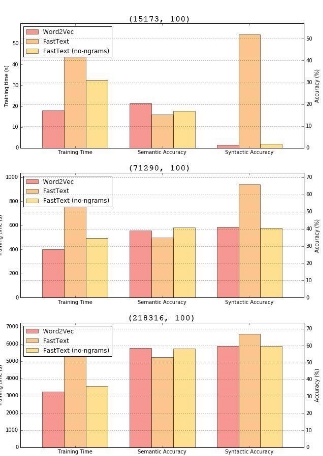
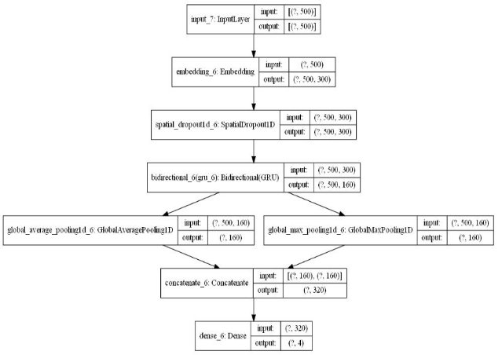

УДК** 044.855.5** 

**Разработка системы автоматического выявления токсичных комментариев в социальных сетях** 

**Васильченко Андрей Владимирович** Студент 

ФГАОУ ВО «Крымский федеральный университет имени В. И. Вернадского» 

***Научный руководитель: Дюличева Юлия Юрьевна** доцент кафедры прикладной математики, к.ф.-м.н.* 

*ФГАОУ ВО «Крымский федеральный университет   имени В. И. Вернадского»* 

**Аннотация.**  Стремительное  распространение  токсичных  сообщений  в социальных  сетях  влечет  за  собой  серьезные  проблемы,  приводящие  к снижению самооценки и проблемам со здоровьем у людей с неустойчивой психикой. Разработка сервисов, направленных на предупреждение буллинга и троллинга  в  социальных  сетях,  становится  одной  из  приоритетных  задач, связанных  с  информационной  безопасностью.  В  данной  работе рассматривалось решение задачи многоклассовой классификации токсичных сообщений на основе градиентного бустинга с помощью библиотеки CatBoost и  нейронных  сетей  с  помощью  Keras.  В  частности,  рассматривались свёрточные нейронные сети, нейронные сети с архитектурой LSTM и GRU. Тестирование  методов  машинного  обучения  проводилось  на  выборке  с комментариями  из  социальной  сети  “Одноклассники”,  доступной  на платформе Kaggle. Наилучший результат распознавания классов токсичных сообщений был достигнут при использовании нейронной сети с GRU. 

**Ключевые  слова**: GRU,  CNN,  LSTM,  CatBoost, токсичные  сообщения, 

кибербуллинг. 

**Abstract.** The rapid sharing of toxic messages in social media causes to the serious problems leading to low self-estimation and health problems for people with mental instability. The development of services aimed at cyberbullying and trolling preventing in social networks becomes one of the priority challenges related to information security. The solution to the problem of multiclass classification of toxic messages based on gradient boosting using the CatBoost library and neural networks using Keras was considered in the research. In particular, convolutional neural network, neural network with LSTM and GRU architecture were investigated. The machine learning methods are tested on a sample with comments from ok.ru social network, available on Kaggle platform. The best results in the multi-class toxic messages recognition were achieved using the neural network with GRU.  

**Keywords**: GRU, CNN, LSTM, CatBoost, toxic messages, cyberbullying. 

Задача выявления токсичных сообщений является актуальной задачей в сфере  информационной  безопасности,  направленной  на  предотвращение распространения информационных угроз таких как, например, кибербуллинг. В  исследовании  рассматривалась  выборка  с  пятью  классами  сообщений (comment, normal, insult, threat, obscenity), доступная на платформе Kaggle [1], которая была дополнена дополнительными сообщениями из социальной сети “Одноклассники” [2].  

Перед применением методов машинного обучения необходимо выполнить предобработку  текста,  включающую  удаление  цифр,  пунктуации, спецсимволов,  ссылок,  электронных  адресов,  стоп-слов;  приведение  к нижнему регистру, замены “ё” на “е”; токенизацию и лематизацию. Далее выполняется преобразование текста сообщений в числовые векторы. В данной работе рассматривались векторные представления на основе Word2Vec [3] и FastText  [4].  Как  видно  из  гистрограмм,  представленных  на  рисунке  1, векторизация на основе FastText превосходит Word2Veс.

Рис. 1. Гистограмма сравнения Word2Vec и FastText 

Для  решения  задачи  многоклассовой  классификации  токсичных сообщений использовался градиентный бустинг, свёрточная нейронная сеть и рекуррентные  нейронные  сети  с  архитектурами  GRU  и  LSTM.  Сравнение качества распознавания токсичных сообщений на основе рассмотренных в работе методов машинного обучения представлено в таблице 1. 

Таблица 1. Сравнение CNN, LSTM, GRU и  градиентного бустинга на основе библиотеки CatBoost 

||accuracy |f1-score |
| :- | - | - |
|GRU |0.9348 |0.9352 |
|LSTM |0.9097 |0.9098 |
|CNN |0.9334 |0.9340 |
|CatBoost |0.9398 |0.8694 |
Оптимизация нейронной сети заключалась в тонкой настройке весовых коэффициентов слоев, подборе гиперпараметров на основе поиска по сетке и использовании  оптимизатора  adam.  Архитектура  итоговой  модели представлена на рисунке 2. 

Рис 2. Архитектура нейронной сети для решения задачи распознавания токсичных сообщений из пяти классов 

Процесс обучения нейронной сети изображен на рисунке 3. 

Рис. 3. Обучение нейронной сети 

Пример  распознавания  принадлежности  сообщения  к  классам токсичности продемонстрирован на рисунке 4. 

Рис 4.  Пример распознавания принадлежности сообщения к классам 

токсичности 

Таким  образом,  наиболее  эффективной  с  точки  зрения  точности распознавания  токсичных  сообщений  оказалась  нейронная  сеть  с архитектурой GRU и векторным представлением FastText. Для обучения и оценки качества классификации использовалась кросс-валидация, а подбор параметров  для  оптимизации  модели  проводился  с  помощью  “метода сеточного поиска”. 

Список литературы 

1. Alexander Semiletov. Toxic Russian Comments. [Электронный ресурс]. – Режим  доступа:  URL: [ https://www.kaggle.com/alexandersemiletov/toxic- russian-comments ](https://www.kaggle.com/alexandersemiletov/toxic-russian-comments)(10.06.2021) 
1. Социальная  сеть  одноклассники.  [Электронный  ресурс].  –  Режим доступа: URL: [ https://ok.ru/ ](https://ok.ru/)(10.06.2021) 
1. Word2Vec. Google. Jul 30, 2013. [Электронный ресурс]. – Режим доступа: URL: [ https://code.google.com/archive/p/word2vec/ ](https://code.google.com/archive/p/word2vec/) (10.06.2021) 
1. FastText. Facebook Inc. [Электронный ресурс]. – Режим доступа: URL: [https://fasttext.cc/ (](https://fasttext.cc/)10.06.2021) 
